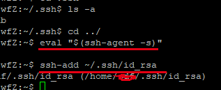

 # ssh 远程登陆服务器
 PuTTY是一款支持Telnet，ssh连接的连接软件。类似于类Unix下的ssh服务，可以通过其连接远程服务器 并进行命令行操作。
 [下载](https://www.chiark.greenend.org.uk/~sgtatham/putty/latest.html)


[Xshell配置ssh免密码登录-密钥公钥(Public key)与私钥(Private Key)登录](http://www.aiezu.com/system/linux/xshell_ssh_public-key_login.html)

[利用 ssh 的用户配置文件 config 管理 ssh 会话](https://www.jianshu.com/p/6162b94110fc)

# 通过ssh远程登录

```bash
ssh root@111.111.111.111
```

- 查看数据盘  `fdisk -l `
- 查看硬盘  `df -h`

ctrl-r   清屏
login incorrect


## 账号管理
### 添加一个管理账号

毕竟每次有用root 账户登录 这样不够安全 所以再自己建一个
首先,远程连接并用root 账户登录
1. 添加账户
`adduser xxxxxx`
`Enter new UNIX password: ....`


2. 设置修改权限

```bash
# 添加xxx 进入管理组
gpasswd -a xxx sudo  

sudo visudo
```

添加

```bash
xxx  ALL=(ALL,ALL) ALL
```

以后就可以 

```bash
ssh xxx@111.111.111.111
#在数据该账号之前设置的密码登录
```


>nano 模式下 如何保存 并退出


直接 `ctrl-x` 退出 会询问是否保存
`Y` 确定 后**回车**

## 实现实现登录无密码登录
原理和github的一样，如果本地配置过github，那本地就已经是有的了

### 本地电脑生成秘钥

1. 生成

```bash
ssh-keygen -t rsa -b 4096 -C "xxx@xxx.com"
```


```bash
 eval "$(ssh-agent -s)"
```

3. 加入代理
```bash
ssh-add ~/.ssh/id_rsa 
```



2. 开启ssh代理
--------

window电脑
看 git 中的笔记

### 在服务器上生成秘钥
```bash
#生成秘钥
ssh-keygen -t rsa -b 4096 -C "xxx@xx.com"

...(yes)
# 开启代理
eval "$(ssh-agent -s)"

# 加入代理 
ssh-add  ~/.ssh/id_rsa


# 进入.ssh 目录下
# 授权钥匙  -- 生成一个授权文件
## 进入后直接 wq!  主要是生成这个文件
vi authorized_keys 

```


vi命令
- q! 退出
- wq! 保存退出

### 把 本地公钥 添加到服务器
进入服务器的`authorized_keys`  文件  
把本地生成的公钥 `id_rsa.pub` 添加进入`authorized_keys`
此时服务器上就已经持有某台电脑的公钥了 ，这台电脑就可以不用密码登录了， 但还有需要配置 

修改 authorized_keys 的权限
```shell
chmod 600 authorized_keys

# 重启 ssh
sudo service ssh restart

```

通过这样配置就可以进ssh 无密码登录，
关键点是给服务器的 `authorized_keys` 添加 电脑的公钥进取，
如果我们使用的是 xshell 或者putty 进行管理 也需要给服务器配置 authorized_keys
以及给软件配置或者生产私钥

[Xshell配置ssh免密码登录-密钥公钥(Public key)与私钥(Private Key)登录](http://www.aiezu.com/system/linux/xshell_ssh_public-key_login.html)


### 如果多个人需要多个公钥呢

**手动追加的方式**

注意追加前authorized_keys文件的末尾需要有个换行符。


账号A生成了id_rsa.pub_A
账号B生成了id_rsa.pub_B
把这两个都拷贝到主机上

到主机上执行：
```bash
cat id_rsa.pub_A >> authorized_keys 
cat id_rsa.pub_B >> authorized_keys 
```


## 修改登录端口
```bash
sudo vi /etc/ssh/sshd_config
```

```bash
# 端口
# 0-65536 都可以用  0-1024 一般都被系统占用 不建议用
port 22 

UseDNS no

·····
PasswordAuthentication yes # 是否允许密码登录  如果开启了ssh 就设置为no
AllowUsers xxx # xxx为管理名
```

然后重启
`sudo service ssh restart`

修改后登录 
`ssh -p 39999 root@111.111.111.1`


## 去掉默认 root 登录端口
比方说阿里云 默认的登录名为root给关掉

```bash
sudo vi /etc/ssh/sshd_config
```

```shell
PermitRootLogin no #是否开启root登录  如果以及配置好多个登录账号了就设置为no 
PasswordAuthentication no # 是否允许密码登录  如果开启了ssh 就设置为no
```

**iptables Fail2Ban 增强安全**


## iptables 防火墙

## 配置文件
------
subl .zshrc  

source .zshrc
